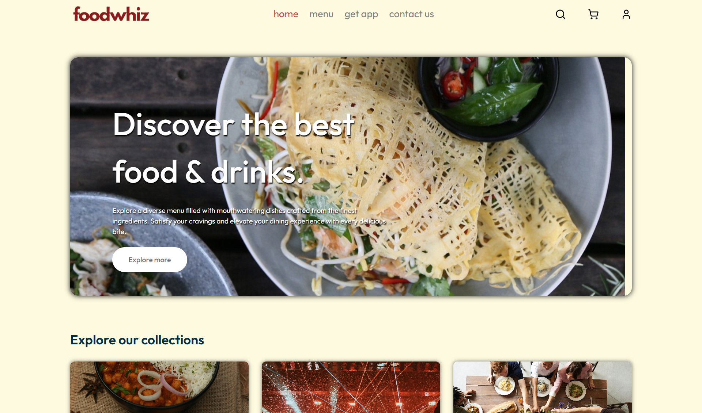

 

   
  <h3 align="center">Online Food Ordering System</h3>

  

     <em>Full-stack Food Delivery platform developed using the MERN stack. It offers a seamless and user-friendly experience for both customers and administrators, ensuring efficient management of food orders, menu items, and delivery processes.</em>
     
     
  

## Links

1. Admin Panel - https://fooddelivery-admin-ouel.onrender.com
2. Client Panel - https://fooddelivery-frontend-szy1.onrender.com

## Built with

## Steps to setup

1. npm create vite@latest client-side/admin-panel
2. Choose `react` as the framework and `javascript` as the type checker
3. cd client-side/admin-panel
4. npm install
5. npm install -D tailwindcss postcss autoprefixer
6. npm run dev

## Other requirements

- Setup environment variables
- Setup frontend-middleware-backend connection

## Features

1. Full-stack Web app (Client, Admin and Middleware)
2. User Authentication and Authorization with JWT
3. Database setup using MongoDB
4. Cart management
5. Image upload using Multer
6. Payment gateway intergated with Stripe
7. Deployed and managed via Render
 

